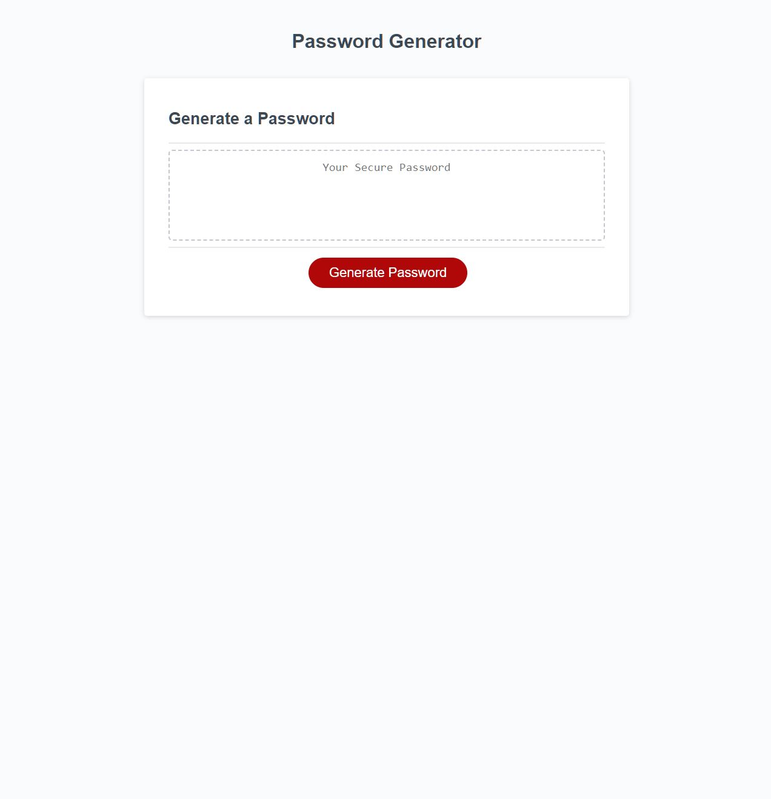

# Random Password Generator

## Description

This is a password generator that will generate a random password based on the criteria you select. 

Criteria include:
<li>Password length (8-128 characters)</li>
<li>Option to include uppercase letters</li>
<li>Option to include lowercase letters</li>
<li>Option to include numbers</li>
<li>Option to include special characters</li>
 
HTML and CSS code were provided. Starter JavaScript code was provided. JavaScript functions and variables were added to make the password generator function correctly.

 
The purpose of creating this password generator was to implement newly learned JavaScript techniques including:
<li>Functions</li>
<li>For loops</li>
<li>If ... else statements</li>
<li>Prompt/Confirm/Alert usage</li>
 

This application is deployed on GitHub pages:
  https://danielschris96.github.io/random-password-generator/

## Usage

After the page is loaded, click the "Generate Password" button and follow the prompts. The password will appear in the text area above the Generate Password button. This password can be copied to your clipboard.

## Credits

https://www.w3schools.com/js/js_random.asp 
https://www.w3schools.com/jsref/jsref_number_nan.asp 
https://www.w3schools.com/js/js_if_else.asp 
https://www.w3schools.com/jsref/met_win_prompt.asp 

## License

None